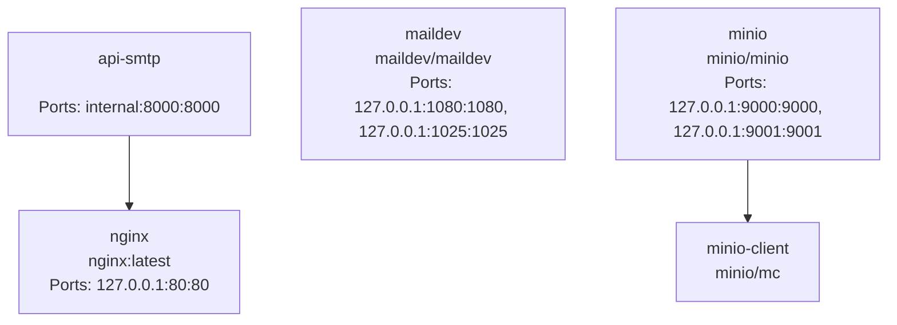
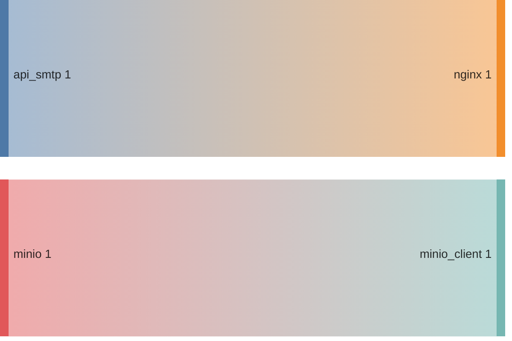
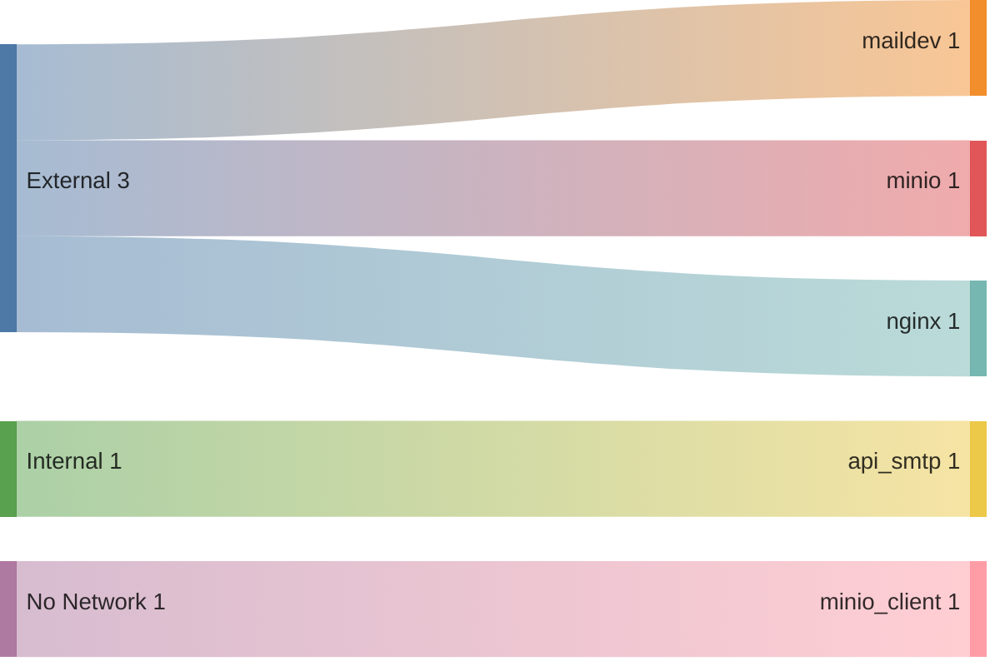
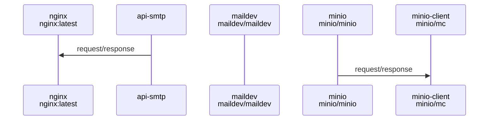

# SMTP Email API - Sistema Completo de Gerenciamento de Emails

Este projeto é uma **API completa de gerenciamento de emails** que não apenas envia emails via SMTP, mas também **recebe, processa e gerencia emails** de forma profissional. Construído com FastAPI, integra-se perfeitamente com MailDev para desenvolvimento e MinIO para armazenamento.

## 🚀 Funcionalidades Principais

### 📤 **Envio de Emails (Original)**
- ✅ Envio de emails via SMTP
- ✅ Suporte a anexos (armazenados no MinIO)
- ✅ Validação completa de campos
- ✅ Autenticação por API key
- ✅ Logs detalhados de sucesso/falha

### 📥 **Recebimento de Emails (Novo)**
- ✅ **Email Receiver** automático via webhook do MailDev
- ✅ Processamento assíncrono em background
- ✅ Armazenamento automático no MinIO
- ✅ Processamento de anexos recebidos
- ✅ API REST completa para consulta

### 🔍 **Gerenciamento e Busca**
- ✅ Listagem de emails recebidos
- ✅ Busca por texto nos emails
- ✅ Estatísticas em tempo real
- ✅ Gerenciamento individual de emails
- ✅ Callbacks personalizáveis

## 🏗️ Arquitetura do Sistema

```
┌─────────────────┐    ┌─────────────────┐    ┌─────────────────┐
│   MailDev       │    │  Email Receiver │    │     MinIO       │
│   (Porta 1080)  │◄──►│   (Python)      │───►│  (Storage)      │
└─────────────────┘    └─────────────────┘    └─────────────────┘
         │                       │                       │
         │                       │                       │
         ▼                       ▼                       ▼
┌─────────────────┐    ┌─────────────────┐    ┌─────────────────┐
│  Web Interface  │    │   FastAPI       │    │  Buckets:       │
│  (Porta 1080)   │    │   (Porta 8000)  │    │  • emails      │
└─────────────────┘    └─────────────────┘    │  • received_emails│
                                              └─────────────────┘
```

## 📁 Estrutura do Projeto

```
.
├── docker-compose.yml
├── readme.md
└── src
    ├── app
    │   ├── main.py                    # API FastAPI principal
    │   ├── requirements.txt            # Dependências Python
    │   ├── smtp_config.json           # Configuração SMTP
    │   ├── email_receiver.py          # 🆕 Módulo Email Receiver
    │   ├── email_receiver_config.json # 🆕 Configuração do Receiver
    │   ├── test_email_receiver.py     # 🆕 Script de testes
    │   ├── demo_email_system.py       # 🆕 Demonstração completa
    │   └── README_EMAIL_RECEIVER.md   # 🆕 Documentação do Receiver
    ├── docker
    │   └── Dockerfile
    └── nginx
        ├── conf.d
        │   └── default.conf
        └── nginx.conf
```

## 🔧 Configuração

### 1. **Configuração SMTP** (`smtp_config.json`)
```json
{
    "api_key": "your_api_key",
    "api_name": "High-Performance SMTP API",
    "api_description": "SMTP API mail dispatch with support for attachments.",
    "smtp_server": "maildev",
    "smtp_port": 1025,
    "max_len_recipient_email": 64,
    "max_len_subject": 255,
    "max_len_body": 50000,
    "use_ssl": false,
    "use_password": false,
    "use_tls": false,
    "sender_email": "your_email@example.com",
    "sender_domain": "devel.local.email",
    "sender_password": "your_password",
    "minio_server": "minio:9000",
    "minio_access_key": "minioadmin",
    "minio_secret_key": "minioadmin",
    "minio_secure": false
}
```

### 2. **Configuração Email Receiver** (`email_receiver_config.json`)
```json
{
    "maildev": {
        "web_port": 1080,
        "smtp_port": 1025,
        "polling_interval": 30,
        "error_retry_interval": 60
    },
    "storage": {
        "bucket_name": "received_emails",
        "max_email_size_mb": 10,
        "max_attachment_size_mb": 5
    },
    "processing": {
        "auto_mark_read": true,
        "save_attachments": true,
        "save_raw_email": false,
        "enable_logging": true
    }
}
```

## 🚀 Instalação

1. **Clone o repositório:**
```bash
git clone https://github.com/gni/api-smtp.git
cd api-smtp
```

2. **Configure e execute os containers Docker:**
```bash
docker-compose up -d
```

3. **Verifique os serviços:**
```bash
docker-compose ps
```

## 📖 Uso

### 📤 **Envio de Emails**

#### Email Simples
```bash
curl -X 'POST' \
  'http://localhost/v1/mail/send' \
  -H 'X-API-Key: your_api_key' \
  -H 'Content-Type: application/json' \
  -d '{
    "recipient_email": "test@dev.local",
    "subject": "Teste do Sistema",
    "body": "Email enviado via API",
    "body_type": "plain"
  }'
```

#### Email com Anexos
```bash
curl -X 'POST' \
  'http://localhost/v1/mail/send-with-attachments' \
  -H 'X-API-Key: your_api_key' \
  -H 'Content-Type: multipart/form-data' \
  -F 'recipient_email=test@dev.local' \
  -F 'subject=Email com Anexo' \
  -F 'body=Conteúdo do email' \
  -F 'attachments=@arquivo.pdf'
```

### 📥 **Recebimento de Emails**

#### Listar Emails Recebidos
```bash
curl -H "X-API-Key: your_api_key" \
     http://localhost/v1/mail/received
```

#### Buscar Emails
```bash
curl -H "X-API-Key: your_api_key" \
     "http://localhost/v1/mail/received/search?query=palavra_chave"
```

#### Estatísticas
```bash
curl -H "X-API-Key: your_api_key" \
     http://localhost/v1/mail/received/statistics
```

## 🧪 Testes

### **Teste Básico do Email Receiver:**
```bash
cd src/app
python test_email_receiver.py
```

### **Teste em Tempo Real:**
```bash
cd src/app
python test_email_receiver.py --listen
```

### **Demonstração Completa:**
```bash
cd src/app
python demo_email_system.py
```

## 🤖 MCP Server - Model Context Protocol

### **O que é MCP?**
O **Model Context Protocol (MCP)** é um padrão aberto que permite que modelos de linguagem (LLMs) se conectem e interajam com sistemas externos de forma segura e padronizada.

### **Por que MCP no Sistema de Emails?**
- 🔗 **Conectividade Universal**: Conecta com Claude, GPT, Gemini e outros LLMs
- 🤖 **Automação Inteligente**: Processamento automático de emails baseado em IA
- 📊 **Contexto Rico**: Acesso ao histórico completo de emails para respostas contextuais
- 🔄 **Workflows Inteligentes**: Automação de tarefas repetitivas de email

### **Funcionalidades do MCP Server**
- 📧 **Leitura de Emails**: Acesso aos emails recebidos e enviados
- 🔍 **Busca Contextual**: Pesquisa inteligente no histórico de emails
- 📝 **Resposta Automática**: Geração automática de respostas baseada em contexto
- 📊 **Análise de Sentimento**: Classificação automática de emails
- 🔄 **Workflow Automation**: Execução automática de tarefas baseadas em conteúdo

### **Arquitetura MCP**
```
┌─────────────────┐    ┌─────────────────┐    ┌─────────────────┐
│   Email API     │    │   MCP Server    │    │   LLM Client    │
│  (FastAPI)      │◄──►│   (Python)      │◄──►│  (Claude/GPT)   │
└─────────────────┘    └─────────────────┘    └─────────────────┘
         │                       │                       │
         ▼                       ▼                       ▼
┌─────────────────┐    ┌─────────────────┐    ┌─────────────────┐
│   MinIO Storage │    │   Context       │    │   AI Processing │
│   (Emails)      │    │   Management    │    │   & Responses   │
└─────────────────┘    └─────────────────┘    └─────────────────┘
```

### **Endpoints MCP Planejados**
- `GET /mcp/emails` - Listar emails para o LLM
- `GET /mcp/emails/{id}` - Obter email específico
- `POST /mcp/emails/{id}/respond` - Gerar resposta automática
- `GET /mcp/context` - Obter contexto da conversa
- `POST /mcp/workflow` - Executar workflow automatizado

### **Exemplo de Uso com Claude**
```python
# Claude pode agora:
# 1. Ler emails recebidos
# 2. Analisar contexto
# 3. Gerar respostas apropriadas
# 4. Executar ações automáticas
# 5. Manter histórico de conversas
```

## 📚 Documentação da API

- **Swagger UI**: [http://localhost/docs](http://localhost/docs)
- **ReDoc**: [http://localhost/redoc](http://localhost/redoc)
- **Email Receiver**: Consulte `README_EMAIL_RECEIVER.md` para detalhes completos

## 🌐 Acessos Disponíveis

| Serviço | URL | Porta | Descrição |
|---------|-----|-------|-----------|
| **API FastAPI** | http://localhost/docs | 80 | Documentação e endpoints |
| **MailDev Web** | http://localhost:1080 | 1080 | Interface de emails |
| **MinIO Console** | http://localhost:9001 | 9001 | Gerenciamento de storage |
| **SMTP** | localhost | 1025 | Envio de emails |

## 🔮 Roadmap e Próximos Passos

### **Fase Atual (Concluída)**
- ✅ API SMTP para envio de emails
- ✅ Email Receiver para recebimento automático
- ✅ Integração com MinIO para storage
- ✅ Sistema completo de gerenciamento

### **Próxima Fase (Em Desenvolvimento)**
- 🔄 **Integração Receiver + Sender**: Unificação dos sistemas em uma API coesa
- 🤖 **MCP Server**: Implementação do Model Context Protocol
- 🔗 **Conectividade com IAs**: Bridge para modelos de linguagem (Claude, GPT, etc.)
- 📊 **Workflows Inteligentes**: Automação baseada em IA
- 🔄 **API Unificada**: Endpoints consolidados para envio e recebimento

### **Fase Futura (Visão)**
- 🚀 **Sistema Unificado**: Integração completa entre envio, recebimento e MCP
- 🧠 **IA para Emails**: Classificação automática, resposta inteligente
- 🌐 **Multi-tenant**: Suporte a múltiplas organizações
- 📱 **Mobile App**: Aplicativo para gerenciamento móvel
- 🤖 **Automação Total**: Processamento inteligente de emails sem intervenção humana

## 👥 Autores e Contribuições

### **Lucian BLETAN** ([@gni](https://github.com/gni))
**Fundador e Desenvolvedor Principal**
- 🎯 **Concepção inicial** do projeto SMTP API
- 🏗️ **Arquitetura base** com FastAPI e MinIO
- 📧 **Sistema de envio** de emails com anexos
- 🔐 **Autenticação e segurança** da API
- 🐳 **Infraestrutura Docker** completa
- 📚 **Documentação técnica** e exemplos

### **Claude Sonnet 4** ([@claude-ai])
**Desenvolvedor do Email Receiver e Integrador**
- 📥 **Email Receiver** completo em Python
- 🔄 **Sistema de listener** automático para MailDev
- 💾 **Integração avançada** com MinIO
- 🚀 **Novos endpoints** para gerenciamento de emails
- 🧪 **Scripts de teste** e demonstração
- 📖 **Documentação completa** do Email Receiver
- 🔗 **Integração perfeita** com a API existente

### **Lucas Argate** ([@lucasargate](https://github.com/lucasargate))
**Desenvolvedor de Integração e MCP Server**
- 🔗 **Integração Receiver + Sender**: Unificação dos sistemas de envio e recebimento
- 🤖 **MCP Server**: Implementação do Model Context Protocol para conexão com IAs
- 🔄 **Sistema Unificado**: Criação de um ecossistema coeso de gerenciamento de emails
- 🌐 **Conectividade IA**: Bridge entre o sistema de emails e modelos de linguagem
- 🚀 **Arquitetura Avançada**: Evolução da arquitetura para suportar MCP
- 📊 **Workflows Inteligentes**: Automação baseada em IA para processamento de emails

## 🤝 Contribuição

Contribuições são bem-vindas! Este projeto é resultado da colaboração entre desenvolvedores humanos e assistentes de IA, demonstrando o potencial da co-criação.

### **Como Contribuir:**
1. Fork o projeto
2. Crie uma branch para sua feature (`git checkout -b feature/AmazingFeature`)
3. Commit suas mudanças (`git commit -m 'Add some AmazingFeature'`)
4. Push para a branch (`git push origin feature/AmazingFeature`)
5. Abra um Pull Request

## 📄 Licença

Este projeto está licenciado sob a **MIT License** - veja o arquivo [LICENSE](LICENSE) para detalhes.

## 🙏 Agradecimentos

- **MailDev** pela excelente ferramenta de desenvolvimento de emails
- **MinIO** pelo storage object robusto e escalável
- **FastAPI** pelo framework Python moderno e performático
- **Comunidade open source** por todas as contribuições

---

## 🎯 **Visão do Projeto**

Este projeto representa a **evolução natural** de uma API SMTP simples para um **ecossistema completo de gerenciamento de emails**. A implementação atual com **MCP (Model Context Protocol)** está transformando o sistema em uma plataforma inteligente e conectada.

### **🔄 Estado Atual (Em Desenvolvimento)**
- 🔗 **Sistema Unificado**: Integração entre envio e recebimento de emails
- 🤖 **MCP Server**: Bridge para conectar com qualquer IA compatível
- 🌐 **Conectividade Universal**: Suporte a Claude, GPT, Gemini e outros LLMs
- 📊 **Workflows Inteligentes**: Automação baseada em IA para processamento

### **🚀 Visão Futura com MCP**
O **Model Context Protocol** permitirá:

- 🤖 **Automação Inteligente** de respostas a emails
- 📊 **Análise Semântica** do conteúdo dos emails
- 🔄 **Workflows Automatizados** baseados em IA
- 🌐 **Integração Universal** com qualquer LLM compatível com MCP
- 📧 **Processamento Contextual** de emails baseado em histórico
- 🎯 **Respostas Personalizadas** adaptadas ao contexto da conversa

### **🔮 Arquitetura MCP**
```
┌─────────────────┐    ┌─────────────────┐    ┌─────────────────┐
│   Email System  │    │   MCP Server    │    │   LLM (Claude,  │
│  (Send+Receive) │◄──►│   (Bridge)      │◄──►│    GPT, etc.)   │
└─────────────────┘    └─────────────────┘    └─────────────────┘
         │                       │                       │
         ▼                       ▼                       ▼
┌─────────────────┐    ┌─────────────────┐    ┌─────────────────┐
│   MinIO Storage │    │   Context       │    │   AI Processing │
│   (Emails)      │    │   Management    │    │   & Responses   │
└─────────────────┘    └─────────────────┘    └─────────────────┘
```

**O futuro é um sistema onde emails não são apenas enviados e recebidos, mas processados, analisados e respondidos de forma inteligente e automatizada através de uma conexão direta com modelos de linguagem avançados.**

<!-- DOCKUMENTOR START -->

### 🐳 Service: nginx
- **Image**: nginx:latest
- **Ports**: 127.0.0.1:80:80
- **Volumes**: ./src/nginx/nginx.conf:/etc/nginx/nginx.conf:ro, ./src/nginx/conf.d:/etc/nginx/conf.d:ro
- **Depends On**: api-smtp
- **Command**: No command specified
#### Environment Variables

| Variable | Value |
|----------|-------|

### 🐳 Service: api-smtp
- **Image**: 
- **Ports**: internal:8000:8000
- **Volumes**: ./data:/app/data
- **Depends On**: 
- **Command**: No command specified
#### Environment Variables

| Variable | Value |
|----------|-------|
| MODULE_NAME | main |
| VARIABLE_NAME | app |

### 🐳 Service: maildev
- **Image**: maildev/maildev
- **Ports**: 127.0.0.1:1080:1080, 127.0.0.1:1025:1025
- **Volumes**: 
- **Depends On**: 
- **Command**: No command specified
#### Environment Variables

| Variable | Value |
|----------|-------|
| MAILDEV_SMTP_PORT | 1025 |
| MAILDEV_WEB_PORT | 1080 |

### 🐳 Service: minio
- **Image**: minio/minio
- **Ports**: 127.0.0.1:9000:9000, 127.0.0.1:9001:9001
- **Volumes**: 
- **Depends On**: 
- **Command**: server /data --console-address ":9001"
#### Environment Variables

| Variable | Value |
|----------|-------|
| MINIO_ROOT_USER | minioadmin |
| MINIO_ROOT_PASSWORD | minioadmin |

### 🐳 Service: minio-client
- **Image**: minio/mc
- **Ports**: 
- **Volumes**: 
- **Depends On**: minio
- **Command**: No command specified
#### Environment Variables

| Variable | Value |
|----------|-------|


## Networks


## Graphs

### Network depend


### Services depend


### Services ports


## Service Interaction Sequence Diagram



## Example Commands

- **Start Services**: `docker compose up -d`
- **Stop Services**: `docker compose down`
- **View Logs for a Service**: `docker compose logs [service]`

## Troubleshooting


- Ensure Docker is running before starting services.

- Check container logs if a service fails to start.

- Verify network connections if services can't communicate.


## Maintenance Tips


- To update a service, modify the image tag and run `docker-compose up -d`.

- Review and apply environment variable changes without rebuilding containers.

<!-- DOCKUMENTOR END -->
